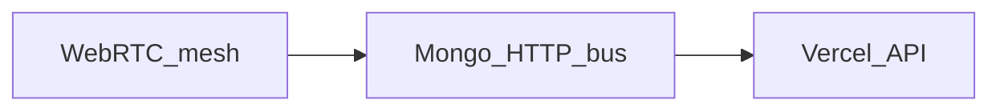

# QuantumMeet — Executive Roadmap (24 Months · ~25 Engineers)

**Program index** for architecture and standing ops. Finished eng objectives are **removed** from OKRs/backlog (not marked done).

---

## Product bet

- **Pillars:** Meetings + Classroom LMS (equal)  
- **GTM:** Education first (tutoring, schools, universities)  
- **Architecture:** Dual Vercel (SPA + API), WebRTC mesh, Mongo/HTTP event bus; **no hosted SFU** ([ADR-002](docs/adr/ADR-002-sfu-evaluation.md))

---

## Program documentation pack

| Doc | Purpose |
|-----|---------|
| [docs/program/ORG.md](docs/program/ORG.md) | 5 squads, RACI, hiring bar, cadence, DoD |
| [docs/program/CAPACITY.md](docs/program/CAPACITY.md) | Capacity model |
| [docs/program/OKRS_Y1.md](docs/program/OKRS_Y1.md) | Year-1 OKRs (cleared) |
| [docs/program/OKRS_Y2.md](docs/program/OKRS_Y2.md) | Year-2 OKRs (cleared) |
| [docs/program/EPICS_BACKLOG.md](docs/program/EPICS_BACKLOG.md) | Standing epics E-901–904 |
| [docs/adr/](docs/adr/) | Architecture decisions |

---

## Standing work

*(Current cycle cleared — see [EPICS_BACKLOG.md](docs/program/EPICS_BACKLOG.md). Re-open quarterly for security / reliability / design / hiring.)*

---

## Explicit non-goals

- Hosted SFU (LiveKit / similar) on this Vercel deploy  
- Socket.io as primary realtime on Vercel  
- Merging client + server into one Vercel project  

---

## How employees start Monday morning

1. Read [ORG.md](docs/program/ORG.md) — find your squad.  
2. Pull standing work from [EPICS_BACKLOG.md](docs/program/EPICS_BACKLOG.md) with TL.  
3. Respect ADRs before changing realtime or media architecture.  

**Questions:** Eng Manager / squad Tech Lead — not the roadmap file.
