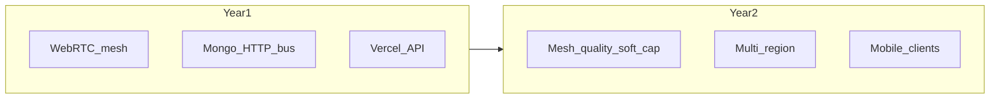

# QuantumMeet — Executive Roadmap (24 Months · ~25 Engineers)

**This is the program index for employees and leadership.**  
It is **not** a claim that two years of product work are finished in code.

Finished light work is **removed** from OKRs and the epics backlog (not marked done). Remaining work lives in [OKRS_Y1.md](docs/program/OKRS_Y1.md) / [OKRS_Y2.md](docs/program/OKRS_Y2.md) and standing epics in [EPICS_BACKLOG.md](docs/program/EPICS_BACKLOG.md).

---

## Product bet

- **Pillars:** Meetings + Classroom LMS (equal)  
- **GTM:** Education first (tutoring, schools, universities)  
- **Architecture:** Dual Vercel (SPA + API), WebRTC mesh, Mongo/HTTP event bus; **no hosted SFU** ([ADR-002](docs/adr/ADR-002-sfu-evaluation.md))

---

## Program documentation pack

| Doc | Purpose |
|-----|---------|
| [docs/program/ORG.md](docs/program/ORG.md) | 5 squads, RACI, hiring bar, cadence, DoD |
| [docs/program/CAPACITY.md](docs/program/CAPACITY.md) | ~55k eng-hours / 2 years; 20% contingency → ~44k planned |
| [docs/program/OKRS_Y1.md](docs/program/OKRS_Y1.md) | Remaining Year-1 OKRs |
| [docs/program/OKRS_Y2.md](docs/program/OKRS_Y2.md) | Remaining Year-2 OKRs |
| [docs/program/EPICS_BACKLOG.md](docs/program/EPICS_BACKLOG.md) | Standing epics E-901–904 + pull order |
| [docs/adr/](docs/adr/) | ADR-001 realtime, ADR-002 mesh-only, ADR-003 multi-region |

---

## Hiring ramp (12 → 25 ICs)

| Milestone | Headcount | Intent |
|-----------|-----------|--------|
| **Y1Q1 start** | 12–15 | Core: Realtime, Meetings, Classroom, Platform, Growth |
| **Y1Q1 end** | 16–18 | Strengthen media + SRE-shaped Platform |
| **Y1Q2 end** | **25** | Full 5×5 squad model |
| **Y1Q3–Y2** | 25 steady | Backfill only |

Detail: [docs/program/ORG.md](docs/program/ORG.md#hiring-ramp-12--25).

Until headcount is 25, plan **60–70%** of steady-state capacity ([CAPACITY.md](docs/program/CAPACITY.md)).

---

## Year outcomes (executive)

| Year | Outcome |
|------|---------|
| **Y1** | Shippable B2B education + meetings product; pilot orgs; mesh soft-cap live |
| **Y2** | Multi-region Atlas; mobile PWA usage; external LTI/calendar; a11y contrast |

### Milestone metrics

| When | Metric |
|------|--------|
| M6 | Call success ≥ 95% on pilots; host-auth abuse incidents = 0 |
| M12 | Pilot orgs active (N from PM); TURN + signaling SLO green |
| M18 | Soft-cap mesh stable; dual-region signaling within SLO |
| M24 | Mobile PWA usage; external integration GA; contrast audit closed |

---

## Quarterly story (one line each)

| Quarter | Theme |
|---------|-------|
| Y1Q1 | Trust & call quality (TURN, host auth, on-call, CI) |
| Y1Q2 | Classroom depth & org tenancy |
| Y1Q3 | Mesh quality; attendance trust |
| Y1Q4 | Enterprise v1 (SSO, billing, E2E, chaos) |
| Y2Q1 | Mesh quality & soft-cap validation |
| Y2Q2 | Multi-region & realtime edge decision |
| Y2Q3 | Mobile & school IT integrations |
| Y2Q4 | Analytics, a11y, i18n, SecretMeet fate |

Full OKRs: [OKRS_Y1.md](docs/program/OKRS_Y1.md) · [OKRS_Y2.md](docs/program/OKRS_Y2.md).

---

## Squads at a glance

| Squad | n | Owns |
|-------|---|------|
| Realtime & Media | 5 | Signaling, TURN, mesh quality |
| Meetings Product | 5 | Room UX, host tools, recording, calendar |
| Classroom / LMS | 5 | LMS, attendance, LTI, teacher analytics |
| Platform / Infra | 5 | CI/CD, Atlas, security, multi-region |
| Growth / Identity / Mobile | 5 | SSO, orgs, billing, mobile, webhooks |

---

## Explicit non-goals (first 12 months)

- Rewriting the entire UI framework  
- Merging client + server into one Vercel project  
- White-label marketplace before tenancy/billing works  
- Hosted SFU (LiveKit / similar) on this Vercel deploy  
- Declaring “2 years complete” via AI-generated stubs  

---

## How employees start Monday morning

1. Read [ORG.md](docs/program/ORG.md) — find your squad.  
2. Read this quarter’s section in OKRs (remaining KRs only).  
3. Pull next work from [EPICS_BACKLOG.md](docs/program/EPICS_BACKLOG.md) with TL.  
4. Respect ADRs before changing realtime or media architecture.  

**Questions:** Eng Manager / squad Tech Lead — not the roadmap file.
